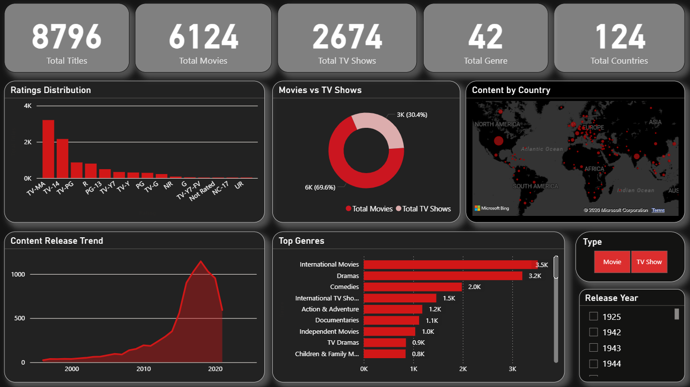

# Netflix Dashboard (Power BI)

## 📊 Overview
This project presents an interactive Power BI dashboard analyzing Netflix content to uncover trends in genres, release years, and content distribution.

## 🎯 Objective
To analyze Netflix data and identify patterns in content type, genre popularity, and global distribution.

## 🚀 Key Insights
- Distribution of Movies vs TV Shows  
- Genre popularity trends  
- Content release trends over time  
- Country-wise content distribution  

## 📈 Features
- KPI cards for content distribution  
- Genre-based analysis  
- Time trend visualization  
- Country-level insights  
- Interactive filters  

## 🛠 Tools & Skills Used
- Power BI  
- Data Modeling  
- DAX  
- Data Visualization  

## 📷 Dashboard Preview

## 📥 Download File
- [Download PBIX File](netflixdashboard.pbix)
- [Download Dataset](netflixdata.xslx)

## 💡 Conclusion
This dashboard helps analyze content trends, understand genre popularity, and evaluate Netflix’s global distribution strategy.
